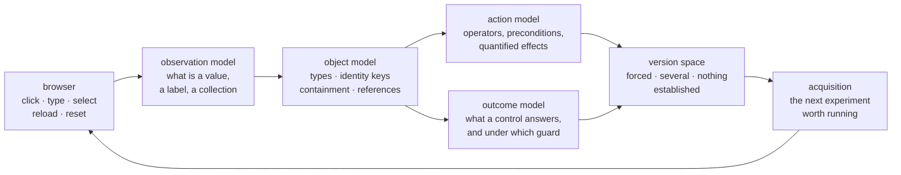

# SemABI

**Learning what an application does by operating it.**

SemABI drives an unfamiliar web application through an ordinary browser — click, type,
select, reload, reset — and comes back with a typed relational model of what the
application contains and what its controls do. It is given no source, no API, no schema,
no documentation, no demonstrations of the task, and no action vocabulary. The learner
itself runs no language model; the LLM baselines under `semabi/baselines/` exist only to
compare against.

The question it exists to answer is narrow and testable:

> Can an agent recover a typed relational action model of an unfamiliar application
> purely by interacting with its interface?

Python 3.12+ · Apache-2.0 · no paid API, no model weights, nothing leaves the machine

---

## See it work

```bash
uv venv --python 3.12 .venv && uv pip install -e .
.venv/bin/python -m semabi.demo
```


*A real run, recorded with `scripts/record_demo.py`. The output is revealed at a readable
pace rather than in the two bursts the program prints it in; the fit time on screen is its
own.*

Five seconds, no browser needed. The learner is handed 91 recorded interactions with a
small dispatch application — a board of runs, a van to attach to each, a weight field and
a button that answers *Dispatch ready* or *Dispatch unavailable* — and is asked what it
learned:

```
What it inferred
──────────────────────────────────────────────────────────────────────────
  No schema, field list or object type was supplied. These are its own.

  type 0   identified by name: Cedar · Rowan · Alder
            fields it reads: Packed weight (kg), Destination depot, Packed kg weight, and 7 more
  type 1   identified by name: Swift · Panel · Box
            fields it reads: Payload limit, Payload kg limit, carrier
            appears inside type 0

What it learned about the button
──────────────────────────────────────────────────────────────────────────
  Clicking Check dispatch answered Dispatch ready and Dispatch unavailable

    if  Payload limit of the object shown inside it  >=  Packed weight (kg) of the object the button sits in
    then the interface answers 'Dispatch ready'   (7 occasions)
    otherwise it answers 'Dispatch unavailable'   (8 occasions)

Tested on a session it never saw
──────────────────────────────────────────────────────────────────────────
   click  what the evidence allowed               what happened
  ────────────────────────────────────────────────────────────────────────
       1  Dispatch ready                          Dispatch ready          exact
       2  Dispatch unavailable                    Dispatch unavailable    exact
       …
       6  Dispatch ready or Dispatch unavailable  Dispatch ready          ambiguous
       …
       8  Dispatch unavailable                    Dispatch unavailable    exact

  7 exact · 1 ambiguous out of 8 clicks on that button
```

Nothing above is stored in the demo. The object types, their identity keys, the field
labels, the comparison and every prediction are read out of a model fitted when you run
it. Add `--live` to watch the whole thing happen for real:

```bash
.venv/bin/playwright install chromium
.venv/bin/python -m semabi.demo --live
```

That starts the bundled application on a local port, drives a real browser through a
demonstration of the workflow, then lets the learner choose about sixty interactions of
its own, fit a model and be tested. Two minutes.

### What that demo is actually showing

1. **Objects, not widgets.** Nobody told it that a page is about a "run" or a "van". It
   found two types, keyed them by the names the pages render, and worked out that one is
   shown *inside* the other.
2. **A comparison between two objects.** The rule it learned relates a field of the van
   to a field of the run it is attached to. Single-object thresholds cannot express that,
   and the fields are named by neither the application nor the learner.
3. **An experiment it chose itself.** In live mode the log prints *the move that
   matters*: the learner types a value **lower** than any it has seen. A number that has
   only ever risen could be a clock rather than a size, and an order over a clock is an
   order over time, so it declines to read one — until it makes the value fall itself. The
   application never hints at this; the learner's own theory says which field to set.
4. **Abstention.** Click 6 is not scored as a success. Two outcomes remained admissible
   under the evidence and the model says so rather than guessing. Of the other 28 held-out
   clicks, 26 are navigation with nothing to predict and 2 are a control seen too rarely to
   establish anything — all reported, none hidden.

It is a prepared fixture, and it is development evidence. What that is worth, and what it
is not, is the subject of the rest of this README.

---

## How it works



**The observation layer** decides what a rendered tree even contains: which text is a
value and which a label, which repeated shapes are a collection, which values survive a
reload and therefore belong to the thing rather than to the view. Most of the project's
failures have lived here rather than in the induction.

**The object layer** turns that into typed instances with identity keys, containment and
references, so that "the same row" means something across pages and sessions.

**The action layer** segments the interaction history into operators with parameters,
preconditions and quantified effects, learned from the deltas that followed them.

**The outcome layer** treats what the interface *says* as a third category, distinct from
state change and from navigation: the message a control returns, split into a frame and
the page values it names, with the guard under which it is returned.

**The version space** answers the question the fitted rules cannot: over *all* rules the
evidence justifies, which outcomes are still possible here? That is what lets the model
answer "forced", "several remain" or "nothing is established" instead of always guessing.

**Acquisition** closes the loop by choosing an interaction whose result would settle
something open — the fall in the demo is one of those.

---

## What is established, and what is not

The project keeps its negative results in the repository and cites them from here.

| Line | What happened | Status |
|---|---|---|
| V0 / V1 | One hidden domain behind three radically different UIs; the model transfers across them | development benchmark |
| V2 | Latent control families; frozen at `v2.0-causal-abstraction` | frozen, development-set gains only |
| **V3** | The frozen V2 compiler against **six applications written by three independent authors** who never saw it: 2 produced no trace at all, and across the other four **19 of 29 hidden operators were exercised and 0 recovered**; all 96 goal candidates were untranslatable | **negative, pre-registered, kept** |
| V3 diagnosis | Given a correct state layer the same inducer recovers 7–11 of those operators | the failure is the state abstraction, not the induction |
| V4 | Joint identity and observation model; relational guards learned and transferred across interaction histories on prepared applications | development results, generalization unestablished |
| Product | The same machinery behind a local HTTP API that publishes learned operations | partial coverage on real applications |

Selected V4 measurements, all on applications prepared for the project and all reproducible
from the retained traces:

- **Cross-object joins.** On a harbour booking application, `Book pilot` and
  `Allocate berth` learn comparisons between two bound objects and carry them to
  interaction histories they were not fitted on: 15 / 15 / 0, 7 / 14 / 0 and 16 / 11 / 0
  (forced right / several admissible / **wrong**) on three held-out corpora.
- **Fresh interfaces.** On three generated applications the learner had never seen, two
  now establish their hidden comparison; the dispatch result is the demo above. The
  reservoir application does not, and why is written down.
- **Sixteen metamorphic invariants at zero.** Rename every name, reverse every
  collection, reverse every table's columns: the frozen models and the learner's own
  verdicts do not move. Two earlier attempts failed these gates, which is how two of the
  repairs were found.

What is **not** established: transfer to an application nobody prepared for the project.
That is the V3 result, it stands, and every V4 number above is development evidence until a
reserved interface says otherwise.

---

## The product path: learned operations over HTTP

The same compiler backs a small local service. It connects to an application, learns
within a bounded budget of authorized UI actions, and publishes what it learned as
operations with JSON schemas that an ordinary client can discover and invoke.

```bash
.venv/bin/python -m semabi.service --data-dir runs/service --port 8860 &

# connect to a running application and learn within a bounded action budget
.venv/bin/python examples/client.py --application-url http://127.0.0.1:8080 --learn

# see what it published, then call one of the operations
.venv/bin/python examples/client.py --connection <id> --inspect
.venv/bin/python examples/client.py --connection <id> --operation <name> \
    --arguments '{"title": "fresh record"}'
```

Each invocation reports what it predicted, what the application answered, what changed on
the page and what it could not establish. On disclosed development applications it has
published five operations on Linkding (eight schema-selected calls passed independent
checks), one on Kanboard, and none on FreshRSS, whose sixteen requested tasks remain
unrouted. The [developer quickstart](docs/product_quickstart.md) is the contract: what the
scopes mean, what a guarded update checks before it writes, and what is deliberately
refused.

---

## Repository layout

```
semabi/demo.py          the demonstration above
semabi/compiler/        the black-box side: it only ever sees the browser
  browser.py            restricted observations and primitives
  evidence.py           append-only interaction log; raw evidence is never discarded
  explorer.py           novelty-weighted exploration
  parse.py abstract.py  structural parsing, persistence, identity keys, relations
  induce.py             operators: segmentation, lifting, effects, preconditions
  active.py             replays, precondition probes, affordance sweeps
  planner.py model.py   planning on the learned model; export
  v2/                   observation hypotheses, counterexamples, diagnostic interventions
  v4/                   identity search, outcome models, version space, acquisition
  runtime.py service.py the product path: published operations over HTTP
semabi/env/             a local application with one hidden state and three different UIs
semabi/hidden/          EVALUATOR ONLY: the hidden domain and its rule variants
semabi/eval/            scoring against hidden ground truth; held-out goals; oracle ladder
experiments/            generated fixture applications, including the demo's
docs/                   the full record, including the failures
runs/                   retained traces and outputs (gitignored)
```

The boundary between the two sides is mechanical: `semabi.compiler` may not import
`hidden`, `env` or `eval`, and `tests/test_boundary.py` checks imports and endpoint
strings statically. Hidden state is written by an evaluator-side hook into a file the
compiler never reads.

---

## Running more than the demo

```bash
.venv/bin/python -m pytest -q                      # the suite

# one full research run: explore -> active experiments -> compile -> evaluate -> goals
.venv/bin/python -m semabi.run_pipeline --run runs/one --ui kanban --labels plain \
    --variant standard --episodes 3 --steps 30 --active-rounds 3 --goals 6
cat runs/one/model.txt runs/one/eval.txt

# matrices over UIs, label modes and seeds, then the report
.venv/bin/python -m semabi.run_matrix --labels plain,obscured,misleading --seeds 0,1 --prefix final
.venv/bin/python -m semabi.run_crossui_all --prefix final
.venv/bin/python -m semabi.report
```

`scripts/` holds the batch jobs behind the retained results (`v4_open_world_batch.sh`,
`v4_outcome_batch.sh`, `v4_admissible_batch.sh` and the rest); `HOUSEKEEPING.md` says
where outputs are allowed to live and what is kept.

---

## How the results are kept honest

- **Pre-registration.** Protocols and expectations are written before the run that tests
  them, and deviations are recorded as deviations (`docs/v3_protocol.md` is the clearest
  example).
- **An information boundary in the code.** Every fit and every scored result carries the
  regime that produced it, after an earlier round of V4 results turned out to be
  transductive at the observation-model layer. That is recorded in
  `docs/v4_chronology.md` rather than quietly fixed.
- **Metamorphic attacks before retention.** Renaming, member reversal and column reversal
  run as a gate; a result that moves under them is not retained.
- **Failures kept.** Rejected mechanisms, failed batteries and refuted explanations stay
  in the record with the evidence that refuted them.

## Reading the record

| Document | What it covers |
|---|---|
| [`docs/results.md`](docs/results.md) | V0/V1: the original question, benchmark and numbers |
| [`docs/v2_status.md`](docs/v2_status.md) | V2 and its freeze |
| [`docs/v3_protocol.md`](docs/v3_protocol.md) · [`docs/v3_result.md`](docs/v3_result.md) · [`docs/v3_diagnosis.md`](docs/v3_diagnosis.md) | the fresh benchmark, the negative result, and where it localizes |
| [`docs/v4_retained.md`](docs/v4_retained.md) | the V4 line to date, part by part, with what each repair cost |
| [`docs/v4_handoff.md`](docs/v4_handoff.md) | custody and protocol for the V4 campaigns |
| [`docs/product_quickstart.md`](docs/product_quickstart.md) | the HTTP service: scopes, guards, and what it refuses |
| [`docs/related_work.md`](docs/related_work.md) | where this sits relative to existing work |

## Licence

Apache-2.0. See [LICENSE](LICENSE).
